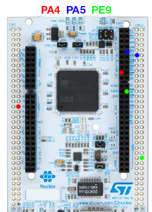

# Generatore-di-Segnali-per-BSPD-testing
Generatore di segnali su scheda STM per il testing dei circuiti del BSPD.

# Pin layout

⚠ Attenzione: PE9 è un DAC PWM, bisogna collegarlo in serie con la massa con un condensatore a 47μF. 

# Fasi

sens_corr = SIG1 = DAC1 = PA4

sens_press_1 = SIG2 = DAC2 = PA5

sens_press_2 = SIG3 = PWM = PE9

LEDs: 🔴🔵🟢

## Fase 0 🔴🔵🟢: reset
0V tutti

## Fase 1 🔴: test logica sensori di corrente
SIG1 = 2.9V

altri invariati

## Fase 2 🔵: test logica sensore di pressione 1
SIG1 = 0V

aspetta 1s

SIG2 = 2.7V

## Fase 3 🟢: test logica sensore di pressione 2
SIG1 = 0  SIG2 = 0V

aspetta 1s

SIG3 = 2.7V

## Fase 4 🔴🔵: test apertura e richiusura dello shutdown crct
SIG1 = 0;  SIG2 = 0V;  SIG3 = 0V

aspetta 1 sec

SIG1 = 2.9V

aspetta 1s

SIG2 = 2.7V

## Fase 5 🔵🟢: test per la non apertura
SIG1 = 0;  SIG2 = 0V;  SIG3 = 0V

aspetta 12s

SIG1 = 2.9V

aspetta 1s

SIG2 = 2.7V

aspetta 0.3s

SIG1 = 0;  SIG2 = 0V;  SIG3 = 0V
